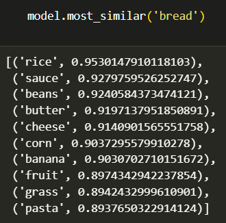
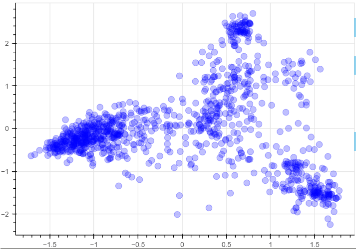
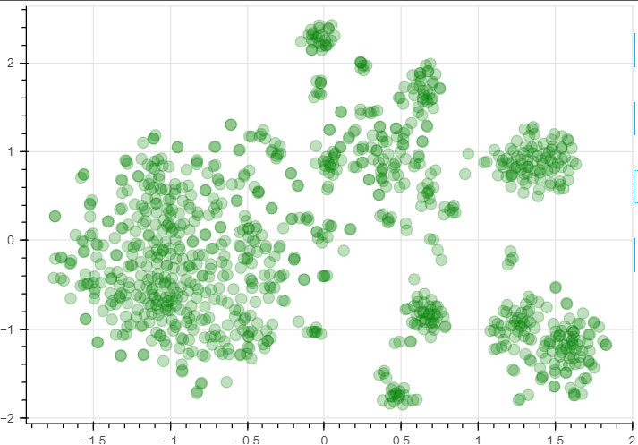
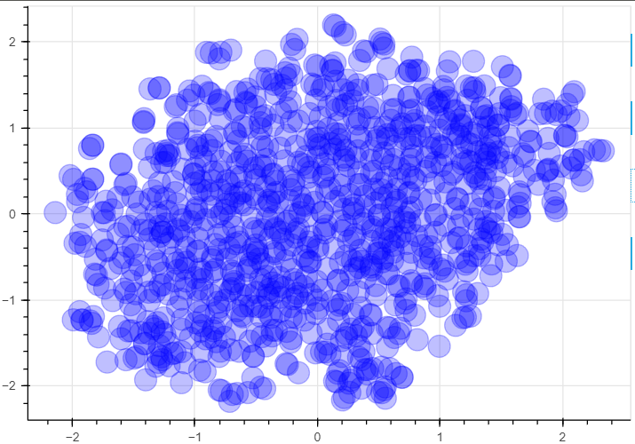

# Word Embeddings

## Описание проекта
В ходе первого проекта, мы создадим наши собственные эмбендинги, загрузим одну из моделей gensim и используем её для виззуализации текстовых корпусов, так же мы создадим простой механизм поиска «похожих вопросов» с помощью встроенных фраз. Итак приступим...

### Word2Vec

Cуществует несколько способов обучения для представления слов. Есть Word2Vec и GloVe с разными целевыми функциями. Еще есть fasttext, который использует модели уровня символов для обучения встраиванию слов. Для нашей задачи будем использовать Word2Vec  

Word2Vec позволяет представить слова в векторном виде, с помощью этого мы можем находить схожие слова в векторном представлении 

<!--  -->

```plaintext

model.most_similar('bread')

[('rice', 0.9530147910118103),
 ('sauce', 0.9279759526252747),
 ('beans', 0.9240584373474121),
 ('butter', 0.9197137951850891),
 ('cheese', 0.9140901565551758),
 ('corn', 0.9037295579910278),
 ('banana', 0.9030702710151672),
 ('fruit', 0.8974342942237854),
 ('grass', 0.8942432999610901),
 ('pasta', 0.8937650322914124)]

```

### Использование предобученной модели

Использование Word2Vec это конечно хорошо, но так же мы можем использовать уже готовые вектора слов. Для использования таких векторов, загрузим готовую модель 'glove-twitter-100'. Один из способов проверить, хороши ли наши векторы, — построить их график. Дело в том, что эти векторы находятся в пространстве 30D+, а мы, люди, больше привыкли к 2-3D.

К счастью, мы знаем о методах снижения размерности.

Давайте используем их для построения графика 1000 наиболее частых слов

#### Linear projection: PCA
Простейший метод линейного снижения размерности — Principial Component Analysis.  
В геометрических терминах PCA пытается найти оси, вдоль которых происходит большая часть дисперсии.




#### t-SNE
PCA хорош, но он строго линейный и, таким образом, способен улавливать только грубую высокоуровневую структуру данных.  
Если вместо этого мы хотим сосредоточиться на сохранении соседних точек рядом, мы можем использовать TSNE



### Визуализация фраз
Word embeddings также можно использовать для представления коротких фраз. Самый простой способ — взять среднее векторов для всех токенов во фразе с некоторыми весами.




## Структура репозитория
- **seminar.ipynb**: Jupyter Notebook с проектом

## Контактная информация
Если у вас есть вопросы или предложения по улучшению проекта, свяжитесь со мной:
- Email: maximgoltsov@gmail.com
